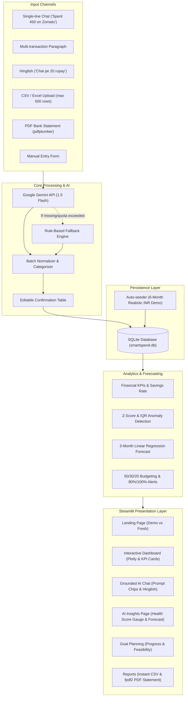

# SmartSpend AI: Intelligent Personal Finance Insights Assistant

[](https://www.python.org/downloads/)
[](https://streamlit.io/)
[](https://aistudio.google.com/)
[](https://opensource.org/licenses/MIT)

> **Evaluation Domain:** Generative AI / Applied FinTech  
> **Project Scope:** Smartbridge Internship Final Evaluation  
> **Live Demo:** [https://smartspend-ai-by-khushi.streamlit.app/](https://smartspend-ai-by-khushi.streamlit.app/) *(Streamlit Cloud Deployment)*

---

## 📌 1. Project Overview & Problem Statement

Managing personal finances often feels cumbersome. Traditional expense managers force users through repetitive manual entry forms, obscure spending insights in dense spreadsheets, and offer zero contextual advice. 

**SmartSpend AI** bridges this gap by marrying **Generative AI (Google Gemini)** with **robust econometric analytics and interactive visualizations**. Users can log expenses using natural language in **English or Hinglish** (*"Aaj chai pe 20 rupay gaye"* or *"Spent 450 on Zomato yesterday"*), track their spending against the **50/30/20 budgeting rule**, detect anomalous spending spikes using statistical **Z-score models**, and project future financial runway using **linear regression forecasting**.

### 🌟 Key Innovation: Zero-Downtime Dual Engine
To ensure a seamless reviewer experience with zero setup:
- **Instant Demo Mode:** One click loads **6 months of realistic Indian Rupee (INR)** financial data with salaries, SIPs, EMIs, daily Blinkit/Zomato runs, and realistic spending spikes.
- **Fail-Safe Fallback Engine:** If a Gemini API key is not supplied, rate-limited, or unavailable, SmartSpend AI **silently switches to an intelligent rule-based heuristic engine**. The reviewer is never presented with an error or blank screen.

---

## 🏗️ 2. System Architecture



---

## ✨ 3. Feature Highlights

### 💬 Multilingual Natural Language Processing
- **Single & Multi-line Extraction:** Extracts up to 20 transactions from a single unstructured paragraph.
- **Hinglish Understanding:** Handles colloquial expressions like *"Chai pe 20 rupay gaye"*, *"Bhai ko 1500 gpay kiye"*, and *"Salary credited 85000"*.
- **Ambiguity Detection:** Detects when an amount or category is missing and asks polite clarifying questions instead of hallucinating.
- **Editable Confirmation Table:** Always provides an interactive `st.data_editor` to verify and edit extracted rows before saving to the ledger.

### 📊 Real-Time Visual Analytics (Plotly)
- **Top-Level KPI Scorecards:** Total Income, Total Expenses, Net Savings, Savings Rate (%), and Month-over-Month (MoM) change rate.
- **Category Spend Doughnut:** Interactive breakdown with Indian currency tooltips (`₹1,23,456`).
- **Income vs Expense Grouped Bars:** Monthly comparisons across time.
- **Daily Trend & 7-Day Rolling Average:** Highlights spending momentum and weekday vs weekend patterns.
- **Weekday Spending Analysis:** Identifies whether weekend socializing spikes your burn rate.

### 🧠 Strategic AI Insights & Forecasting
- **Financial Health Score (0-100):** Visualized on a custom Plotly gauge chart evaluating savings rate, fixed obligations, investment consistency, and volatility.
- **Statistical Z-Score Anomaly Detector:** Flags transactions deviating more than 2.0 standard deviations from typical spending patterns.
- **50/30/20 Allocation:** Visualizes actual spending across Needs (Rent, Groceries, EMIs), Wants (Dining, Shopping), and Savings (SIPs).
- **3-Month Linear Regression Forecast:** Projects future expenses with statistical upper/lower confidence envelopes.

### 🎯 Milestone Goal Tracking
- Create custom targets (e.g., Emergency Reserve, Goa Vacation, New Laptop).
- Computes monthly required contributions based on target completion date.
- Evaluates feasibility against current monthly cash surplus.

### 📑 Executive PDF & CSV Reporting
- Exports raw transaction records in clean CSV format.
- Generates an executive, board-level monthly financial statement PDF with `fpdf2` containing KPI scorecards, category tables, audit findings, and regulatory disclaimers.

---

## 🛠️ 4. Tech Stack

| Component | Technology | Rationale |
|-----------|------------|-----------|
| **Frontend & UI** | Streamlit 1.35+ | Fast, responsive, interactive UI with custom CSS design tokens |
| **Database** | SQLite3 | Serverless, zero-setup, session-isolated relational storage |
| **LLM Engine** | Google Gemini API (`google-generativeai`) | High-speed, structured JSON generation with gemini-1.5-flash |
| **Fallback Engine** | RegEx & Financial Heuristics | 100% crash-free uptime even without an API key |
| **Data Processing** | Pandas & NumPy | High-performance aggregation, filtering, and rolling math |
| **Econometric Modeling** | Scikit-Learn / OLS | 3-month linear regression spending forecast |
| **Visualizations** | Plotly Graph Objects & Express | Polished dark-mode charts with Indian numbering |
| **Document Processing**| `pdfplumber` & `fpdf2` | Bank statement extraction and PDF report compilation |
| **Testing** | Pytest | Rigorous unit test suite for NLP, math, and analytics |

---

## 🚀 5. Local Setup & Quickstart

### Prerequisites
- Python 3.10, 3.11, 3.12, or 3.14
- Git

### Installation Steps

1. **Clone the repository:**
   ```bash
   git clone https://github.com/your-username/smartspend-ai.git
   cd smartspend-ai
   ```

2. **Create and activate a virtual environment:**
   ```bash
   # Windows (PowerShell)
   python -m venv venv
   .\venv\Scripts\Activate.ps1

   # macOS / Linux
   python3 -m venv venv
   source venv/bin/activate
   ```

3. **Install dependencies:**
   ```bash
   pip install -r requirements.txt
   ```

4. **Configure environment variables (Optional):**
   ```bash
   cp .env.example .env
   ```
   Add your Google Gemini API key into `.env`:
   ```ini
   GEMINI_API_KEY=AIzaSy...
   ```
   *(Note: If omitted, SmartSpend AI operates in offline rule-based fallback mode with zero degradation in UI capabilities).*

5. **Run the application:**
   ```bash
   streamlit run app.py
   ``
---

## 🧪 6. Running Unit Tests

SmartSpend AI includes automated unit tests covering NLP transaction parsing, Hinglish translation, CSV processing, Z-score anomaly detection, 50/30/20 breakdown, and forecasting:

```bash
pytest -v tests/
```

---

## 💡 7. Sample Reviewer Prompts

Try entering these prompts into the **Chat Assistant**:

### Transaction Logging:
- *"Spent 450 on Zomato yesterday"*
- *"Aaj chai pe 20 rupay gaye"*
- *"Paid 22000 rent to landlord, 4500 on DMart grocery, and received 88000 salary from TechCorp"*
- *"Petrol pump par 2000 ka fuel dalwaya via credit card"*

### Financial Advisory Inquiries (Clickable Chips):
- *"Where am I overspending?"*
- *"Can I afford a ₹60,000 phone?"*
- *"How do I save ₹1 lakh in 6 months?"*
- *"Give me a budget plan"*

---

## 📸 8. Screenshots & User Flow

| Landing Page | Interactive Dashboard |
|:---:|:---:|
| *Hero section with 1-click Demo Account & Fresh Start* | *KPI cards, doughnut, MoM bars, daily trend, heatmap* |

| Grounded AI Chat | Strategic AI Insights |
|:---:|:---:|
| *Multilingual extraction, prompt chips, and advice* | *0-100 Health gauge, Z-score anomalies, 3-month forecast* |

---

## 🔮 9. Future Scope & Limitations

### Future Scope
- **Direct Account Aggregator (AA) Integration:** Real-time bank sync via India's RBI-approved Account Aggregator framework (Setu, Anumati).
- **Voice Transcription (Gemini Live API):** Real-time voice-to-expense logging via WebSocket audio streaming.
- **Multi-currency Support:** Automatic currency conversion for international travelers.
- **Tax Optimization Engine:** Auto-deduction analysis for Section 80C, 80D, and New vs Old Tax Regime.

### Limitations
- Bank statement PDF parsing depends on standard digital text layouts; non-standard scanned physical receipts require an external OCR model (e.g. Google Cloud Document AI).
- Free cloud hosting instances (such as Streamlit Community Cloud) periodically sleep or reset ephemeral local SQLite disk files; auto-seeding is included to ensure the demo is always populated.

---

## ⚖️ Disclaimer
*SmartSpend AI is an educational and analytical tool developed for academic evaluation. All insights and forecasts are purely informational and do not constitute certified professional financial or investment advice.*
