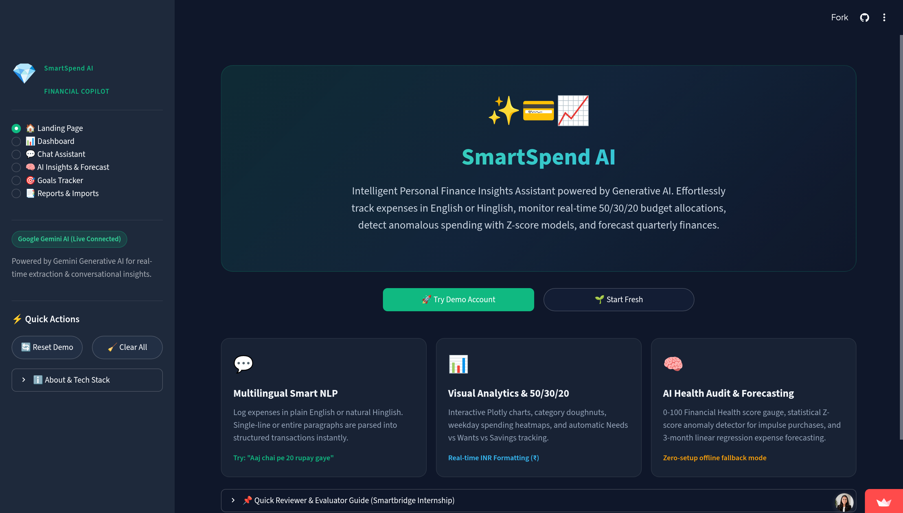
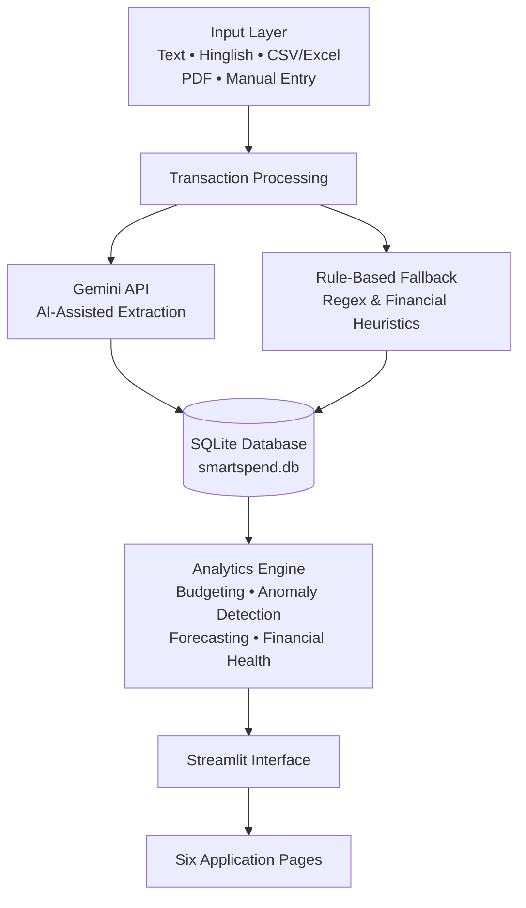
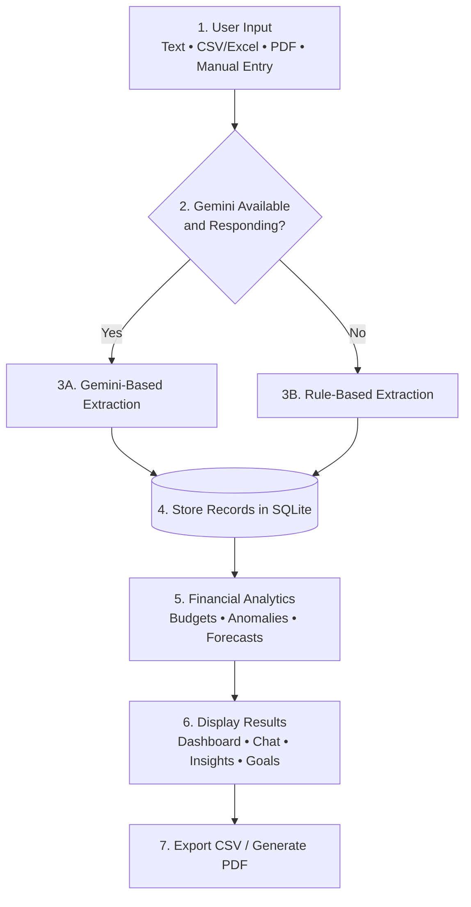

# SmartSpend AI — Intelligent Personal Finance Insights Assistant

SmartSpend AI is a personal finance analytics application designed to help users understand and manage their financial activity from a single platform. It combines transaction processing, AI-assisted data extraction, financial analytics, budgeting, anomaly detection, forecasting, and interactive visualization.

Users can add transactions using natural-language descriptions, import financial records from supported CSV/Excel files or PDF statements, or enter transactions manually. The application converts this information into structured transaction data and presents it through dashboards, insights, savings goals, and reports.

## Live Demo

  

**Live Demo:** [SmartSpend AI](https://smartspend-ai-assist.streamlit.app/)

---

## 📌 Table of Contents

- [Problem Statement](#-problem-statement)
- [Solution Overview](#-solution-overview)
- [System Architecture](#-system-architecture)
- [Application Pages — Six Core Modules](#-application-pages--six-core-modules)
- [Technical Implementation](#-technical-implementation)
- [End-to-End Workflow](#-end-to-end-workflow)
- [Technology Stack](#-technology-stack)
- [Limitations](#-limitations)
- [Future Scope](#-future-scope)
- [Disclaimer](#disclaimer)

---

## 1. Problem Statement

Managing personal finances involves more than simply recording income and expenses. Users need to understand where their money is being spent, monitor their budgets, identify unusual transactions, track savings, and estimate future expenses.

Traditional methods such as manual spreadsheets can make this process time-consuming and provide limited analytical support. Financial information may also come from different sources and formats, making it difficult to maintain a consistent transaction record.

SmartSpend AI addresses this problem by bringing **transaction management, financial analysis, visualization, and reporting together in one application**.

---

## 2. Solution Overview

SmartSpend AI converts user-provided financial information into structured transaction records and uses those records to generate financial summaries and analytical insights.

The application supports multiple input methods, including natural-language transaction descriptions, CSV/Excel files, PDF bank statements, and manual entry. Natural-language inputs can be provided in supported English and Hinglish formats.

For AI-assisted processing, the application can use the Google Gemini API. When Gemini is unavailable or not configured, a rule-based processing engine provides an alternative for supported inputs.

The processed transactions are stored in SQLite and used by the analytics layer for budgeting, anomaly detection, forecasting, and financial health analysis. The results are then presented through an interactive Streamlit interface.

### Key Features

- **Natural-Language Entry:** Process supported English and Hinglish expense descriptions.
- **Multiple Input Methods:** Import CSV/Excel files, extract text from PDF bank statements, or enter transactions manually.
- **AI-Assisted Processing:** Use Google Gemini for structured transaction extraction and conversational responses when available.
- **Rule-Based Fallback:** Process supported inputs without depending entirely on the Gemini API.
- **Financial Dashboard:** View income, expenses, savings, category distributions, and spending trends.
- **Budget Monitoring:** Analyze spending using the 50/30/20 budgeting framework with configured threshold alerts.
- **Anomaly Detection:** Identify potentially unusual spending using Z-score and IQR-based methods.
- **Expense Forecasting:** Estimate future expense trends using linear regression.
- **Savings Goals:** Create financial goals and track progress toward target amounts.
- **Reports and Exports:** Review transaction records, export data to CSV, and generate PDF reports.

---

## 3. System Architecture

The application follows a layered architecture in which financial information moves from the input layer through transaction processing and storage, then into the analytics engine before being presented through the Streamlit interface.

**Figure 1. System Architecture of SmartSpend AI**

### Architecture Components

- **Input Layer:** Accepts natural-language descriptions, English/Hinglish text, CSV/Excel files, PDF statements, and manual transactions.
- **Processing Layer:** Converts supported inputs into structured transaction information using Gemini-assisted processing or the rule-based fallback.
- **Database Layer:** Stores structured transaction records in SQLite.
- **Analytics Engine:** Processes transaction data to calculate financial summaries, budget allocations, anomaly indicators, expense forecasts, and the financial health score.
- **Presentation Layer:** Displays the processed information through the Streamlit interface and its six application pages.

---

## 4. Application Pages — Six Core Modules

### 4.1 Landing Page

The landing page introduces SmartSpend AI and provides the starting point for using the application. Users can explore the available demo data or begin with a fresh financial ledger.

### 4.2 Financial Dashboard

The Financial Dashboard provides a consolidated view of the user's financial activity.

It displays key indicators such as:

- Total income
- Total expenses
- Net savings
- Savings rate

Interactive visualizations provide additional views of category-wise spending, monthly comparisons, daily spending trends, and recent transactions.

### 4.3 AI Chat Assistant

The AI Chat Assistant provides a conversational interface for supported natural-language transaction entry and financial queries.

Users can describe transactions in English or Hinglish, while Gemini-assisted responses are available when the API is configured and accessible.

### 4.4 AI Insights & Forecast

This module brings together the application's analytical results to provide a broader view of financial behavior.

It includes:

- Financial health score
- Budget allocation analysis
- Potential anomaly indicators
- Expense forecasts

The financial health score is generated using the application's implemented scoring logic.

### 4.5 Goals Tracker

The Goals Tracker allows users to create savings goals by defining target amounts and monitoring their progress.

It provides a simple way to keep financial objectives visible alongside regular spending analysis.

### 4.6 Reports & Imports

The Reports & Imports module provides tools for managing financial records.

It supports:

- CSV/Excel imports
- PDF statement processing
- Manual transaction entry
- Transaction ledger review
- CSV export
- PDF report generation

---

## Application Screenshots

Add selected screenshots from the actual application below this section.

Recommended screenshots include:

- Landing Page
- Financial Dashboard
- AI Chat Assistant
- AI Insights & Forecast
- Goals Tracker
- Reports & Imports

Screenshots should be kept consistent in size with short captions so that the README remains easy to navigate.

---

## 5. Technical Implementation

### Transaction Processing

Natural-language descriptions and supported financial files are converted into structured transaction information.

PDF bank statement text extraction is handled using **pdfplumber**.

### Dual-Engine Design

The application uses two processing approaches.

**Gemini-based processing** provides AI-assisted transaction extraction and conversational responses when the Gemini API is configured and available.

**Rule-based processing** uses regular expressions and financial heuristics as an alternative for supported inputs when Gemini is unavailable.

The two approaches may produce different results for complex or ambiguous inputs.

### Data Storage

Transaction records are stored in a **SQLite database**. The database provides persistent structured storage for the transaction data used by the application's analytical modules.

### Financial Analytics

**Pandas** and **NumPy** are used for data processing and numerical calculations.

Potentially unusual transactions are identified using **Z-score and IQR methods**. These methods provide statistical indicators for transactions that differ from observed spending patterns.

Expense forecasting uses **linear regression** to estimate future expense trends based on available transaction history.

### Budgeting and Financial Health

The application uses the **50/30/20 budgeting framework** for budget allocation analysis and configured threshold alerts.

A financial health score is calculated using the application's implemented scoring logic to provide an additional summary of the available financial data.

### Visualization and Reporting

**Streamlit** provides the interactive application interface, while **Plotly** is used for interactive charts and visualizations.

The application uses **fpdf2** to generate PDF reports and supports CSV export for transaction records.

---

## 6. End-to-End Workflow

The workflow describes how financial information moves through the application from initial input to analysis and reporting.

**Figure 2. End-to-End Transaction Processing Workflow**

### Workflow Explanation

1. **Input:** The user enters a transaction, uploads a supported financial file, or adds a transaction manually.
2. **Processing:** The application uses Gemini when available or uses the rule-based processing engine as an alternative.
3. **Storage:** The extracted transaction information is stored in SQLite.
4. **Analysis:** The analytics engine calculates financial metrics, budget allocations, anomaly indicators, forecasts, and other supported insights.
5. **Presentation:** The processed results are displayed through the relevant application pages.
6. **Reporting:** Users can export transaction records to CSV or generate PDF reports.

---

## 7. Technology Stack

| Technology | Purpose |
|---|---|
| **Python** | Application logic and financial calculations |
| **Streamlit** | Interactive web interface |
| **SQLite3** | Transaction data storage |
| **Google Gemini API** | AI-assisted extraction and conversational responses |
| **Regular Expressions** | Rule-based transaction parsing |
| **Pandas & NumPy** | Data processing and numerical analysis |
| **Scikit-learn / Linear Regression** | Expense forecasting |
| **Plotly** | Interactive charts and visualizations |
| **pdfplumber** | PDF text extraction |
| **fpdf2** | PDF report generation |
| **pytest** | Automated testing |
| **Streamlit Community Cloud** | Application deployment |

---

## 8. Limitations

- **PDF Compatibility:** Extraction depends on document readability and layout. Scanned statements may require OCR.
- **Parsing Accuracy:** Ambiguous descriptions and unfamiliar formats may affect transaction extraction.
- **API Availability:** Gemini-based features depend on API configuration, availability, and applicable usage limits.
- **Forecast Uncertainty:** Linear regression provides an estimated trend and cannot reliably account for unexpected changes in future spending.
- **Anomaly Interpretation:** Statistical outliers are not necessarily errors or fraudulent transactions and require user review.
- **Financial Health Score:** The score is application-generated and is not a standardized financial rating.
- **Data Persistence:** Long-term storage depends on the deployment environment and its database configuration.

---

## 9. Future Scope

The application can be extended with additional capabilities such as:

- OCR support for scanned bank statements and receipt images
- Improved transaction categorization
- Support for additional financial statement formats
- Recurring expense and subscription tracking
- Additional forecasting techniques using longer transaction histories
- More personalized budgeting and savings insights
- Improved persistent cloud storage for long-term transaction management
- Expanded automated testing for transaction parsing, analytics, imports, and exports

---

## Disclaimer

SmartSpend AI is intended for **informational and educational purposes**. Its analytical outputs, forecasts, anomaly indicators, financial health score, and other calculations are based on the application's implemented logic and available transaction data.

The results should not be considered professional financial, investment, tax, or legal advice.
